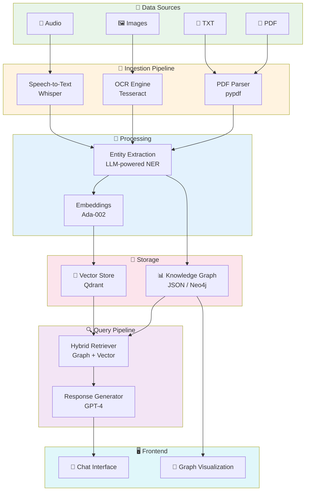

<p align="center">
  
</p>

<h1 align="center">⚡ Pokédex</h1>
<h3 align="center">Enterprise-Grade Multimodal RAG System</h3>
<h4 align="center"><em>Gotta Retrieve 'Em All!</em></h4>

<p align="center">
  <a href="#-quick-start"></a>
  <a href="#-features"></a>
  <a href="#-architecture"></a>
  <a href="#-api-reference"></a>
</p>

<p align="center">
  
  
  
  
  
  
  
</p>

<p align="center">
  <a href="https://www.loom.com/share/a0107a9ab16443319343a034956b001f">
    
  </a>
</p>

---

## 🎬 Demo

**[▶️ Watch the full demo on Loom](https://www.loom.com/share/a0107a9ab16443319343a034956b001f)**

See Pokédex in action: multimodal file upload, natural language queries, knowledge graph visualization, and evaluation logging!

---

## 🎯 What is Pokédex?

**Pokédex** is a production-ready, multimodal Retrieval-Augmented Generation (RAG) system built with modern best practices. While it uses Pokémon data as a fun demonstration domain, the architecture is designed for real enterprise use cases.

Think of it as your personal **Pokédex powered by AI** — but the underlying tech can handle any domain: legal documents, medical records, technical manuals, or multimedia content.

> **Example Query**: "What are Bulbasaur's types and evolution chain?"
>
> **Response**: 🌿 Bulbasaur is a dual-type Grass/Poison Pokémon introduced in Generation I. It evolves into Ivysaur at level 16, which then evolves into Venusaur at level 32.
>
> *Sources: Bulbasaur_Bulbapedia.pdf, bulbasaur_debut.mp3*

---

## ✨ Features

<table>
<tr>
<td width="50%">

### 🔮 Multimodal Ingestion
- **📄 Text**: PDF & TXT documents
- **🖼️ Images**: PNG, JPG with OCR extraction
- **🎵 Audio**: MP3 with speech-to-text
- **🎬 Video**: Coming soon!

### 🧠 Hybrid RAG Pipeline
- Knowledge Graph + Vector Search
- Cross-modal entity linking
- Semantic similarity retrieval
- Graph-based relationship traversal

</td>
<td width="50%">

### 📊 Enterprise Features
- **Evaluation-First Design**: Built-in metrics & logging
- **Observability**: Query logs with full context
- **Extensible**: Modular, testable components
- **Battle-Tested**: Comprehensive test suite

### 🎨 Modern UI
- Real-time chat interface
- Interactive knowledge graph
- File upload & processing
- Evaluation log viewer

</td>
</tr>
</table>

---

## 🏗️ Architecture



---

## 🚀 Quick Start

### Prerequisites

| Requirement | Version | Purpose |
|-------------|---------|---------|
| Python | 3.9+ | Backend runtime |
| Node.js | 18+ | Frontend runtime |
| pnpm/npm | Latest | Package manager |
| OpenAI API Key | — | LLM & embeddings |
| Qdrant Cloud | — | Vector database |

### 1️⃣ Clone & Setup

```bash
# Clone the repository
git clone https://github.com/yourusername/pokerag.git
cd pokerag

# Backend setup
cd server
python -m venv venv
source venv/bin/activate  # Windows: venv\Scripts\activate
pip install -r requirements.txt

# Create environment file
cp .env.example .env
# Edit .env with your API keys
```

### 2️⃣ Configure Environment

Create `server/.env`:

```bash
# Required
OPENAI_API_KEY=sk-your-openai-key-here

# Qdrant Cloud
QDRANT_URL=https://your-cluster.region.aws.cloud.qdrant.io
QDRANT_API_KEY=your-qdrant-api-key
QDRANT_COLLECTION=pokemon_corpus
```

### 3️⃣ Initialize Qdrant Collection

In your Qdrant Cloud dashboard, create a collection:
- **Name**: `pokemon_corpus`
- **Vector Size**: `1536`
- **Distance**: `Cosine`

### 4️⃣ Run Ingestion Pipeline

```bash
cd server

# Ingest and preprocess the multimodal corpus
python -m scripts.ingest

# Build the knowledge graph
python -m scripts.process
```

### 5️⃣ Start the Services

```bash
# Terminal 1: Backend API
cd server
uvicorn api.main:app --reload --port 8000

# Terminal 2: Frontend
cd client
pnpm install
pnpm dev
```

### 6️⃣ Open the App

Navigate to **http://localhost:3000** and start asking questions!

**🎮 Try these queries:**
- "What types is Bulbasaur?"
- "Tell me about Charmander's evolution chain"
- "Compare the starter Pokémon from Generation 1"
- "What are Squirtle's abilities?"

---

## 📁 Project Structure

```
pokerag/
├── 📂 client/                    # Next.js Frontend
│   ├── app/                      # App router pages
│   │   ├── page.tsx              # Main chat + graph UI
│   │   ├── layout.tsx            # Root layout
│   │   └── globals.css           # Global styles
│   ├── components/               # React components
│   │   ├── GraphView.tsx         # Knowledge graph visualization
│   │   └── ui/                   # shadcn/ui components
│   └── package.json
│
├── 📂 server/                    # FastAPI Backend
│   ├── api/                      # API layer
│   │   ├── main.py               # FastAPI app entry
│   │   └── routes/               # API endpoints
│   │       ├── graph.py          # GET /graph
│   │       ├── ingest.py         # POST /ingest, /add/*
│   │       ├── llm.py            # POST /chat
│   │       ├── logs.py           # GET /logs
│   │       └── process.py        # POST /process
│   │
│   ├── ingestion/                # Data ingestion modules
│   │   ├── text_ingestion.py     # PDF/TXT processing
│   │   ├── image_ingestion.py    # OCR extraction
│   │   └── audio_ingestion.py    # Speech-to-text
│   │
│   ├── processing/               # Core processing
│   │   ├── embeddings.py         # Vector embeddings
│   │   ├── entity_extraction.py  # LLM-based NER
│   │   ├── graph_builder.py      # Knowledge graph
│   │   ├── graph_store.py        # Graph persistence
│   │   └── vector_store.py       # Qdrant operations
│   │
│   ├── data/                     # Data storage
│   │   ├── raw/                  # Original files
│   │   │   ├── text/             # PDFs, TXTs
│   │   │   ├── images/           # PNGs, JPGs
│   │   │   └── audio/            # MP3s
│   │   └── processed/            # Processed JSONL
│   │
│   ├── eval_logging/             # Evaluation framework
│   ├── tests/                    # Test suite
│   └── requirements.txt
│
├── 📂 docs/                      # Documentation
│   ├── API.md                    # API reference
│   └── ARCHITECTURE.md           # Deep dive
│
├── 📄 CONTRIBUTING.md            # Contribution guide
├── 📄 CODE_OF_CONDUCT.md         # Community guidelines
├── 📄 SECURITY.md                # Security policy
├── 📄 LICENSE                    # MIT License
└── 📄 README.md                  # You are here!
```

---

## 🔌 API Reference

### Core Endpoints

| Method | Endpoint | Description |
|--------|----------|-------------|
| `GET` | `/health` | Health check |
| `POST` | `/chat` | Query the RAG system |
| `GET` | `/graph` | Get knowledge graph JSON |
| `GET` | `/logs` | Get evaluation logs |
| `POST` | `/ingest` | Trigger full ingestion |
| `POST` | `/process` | Rebuild knowledge graph |
| `POST` | `/add/text` | Upload text file |
| `POST` | `/add/image` | Upload image file |
| `POST` | `/add/audio` | Upload audio file |

### Example: Chat Request

```bash
curl -X POST http://localhost:8000/chat \
  -F "message=What types is Bulbasaur?"
```

```json
{
  "content": "Bulbasaur is a dual-type Grass/Poison Pokémon...",
  "node": {
    "name": "Bulbasaur",
    "generation": 1,
    "primary_type": "Grass",
    "secondary_type": "Poison"
  }
}
```

> 📚 See [docs/API.md](docs/API.md) for complete API documentation.

---

## 🧪 Testing

```bash
cd server

# Run all tests
pytest

# Run with coverage
pytest --cov=. --cov-report=html

# Run specific test file
pytest tests/test_api.py -v

# Run DeepEval tests (requires OpenAI)
pytest tests/test_deepeval.py -v
```

### Test Coverage

| Module | Coverage | Description |
|--------|----------|-------------|
| Ingestion | ✅ | Text, image, audio pipelines |
| API | ✅ | All endpoints |
| Graph | ✅ | Entity extraction & graph building |
| Evaluation | ✅ | DeepEval integration |

---

## 📊 Evaluation Framework

Pokédex is built with an **evaluation-first** approach:

```python
# Every chat query logs:
{
    "timestamp": "2025-01-11T10:30:00Z",
    "query": "What types is Bulbasaur?",
    "answer": "Bulbasaur is a dual-type...",
    "retrieved_context": [...],
    "evaluation": {
        "grounded_in_graph": true,
        "latency_ms": 1234
    },
    "focused_pokemon": {
        "name": "Bulbasaur",
        "generation": 1
    }
}
```

### Metrics Tracked

- **Retrieval Quality**: How well context matches queries
- **Hallucination Rate**: Unsupported content detection
- **Answer Accuracy**: Factual correctness
- **Response Latency**: End-to-end timing

---

## 🤝 Contributing

We welcome contributions! Whether you're fixing bugs, adding features, or improving docs.

```bash
# Fork and clone
git clone https://github.com/yourusername/pokerag.git

# Create a branch
git checkout -b feature/amazing-feature

# Make changes and test
pytest

# Submit a PR
```

> 📖 See [CONTRIBUTING.md](CONTRIBUTING.md) for detailed guidelines.

---

## 🛡️ Security

Found a security issue? Please report it responsibly.

> 📧 See [SECURITY.md](SECURITY.md) for our security policy.

---

## 📜 License

This project is licensed under the **MIT License** - see the [LICENSE](LICENSE) file for details.

---

## 🙏 Acknowledgments

- **Pokémon** is a trademark of Nintendo, Creatures, and Game Freak
- Data sourced from [Bulbapedia](https://bulbapedia.bulbagarden.net/)
- Built with ❤️ using OpenAI, Qdrant, FastAPI, and Next.js

---

<p align="center">
  
  
  
  
</p>

<p align="center">
  <strong>Made with ⚡ by Pokémon Trainers who also write code</strong>
</p>

<p align="center">
  <sub>If you find this project useful, consider giving it a ⭐!</sub>
</p>
