# 🏛️ Pokédex Architecture

> A deep dive into the system design and implementation details

## Table of Contents

- [Overview](#overview)
- [System Architecture](#system-architecture)
- [Data Flow](#data-flow)
- [Component Details](#component-details)
- [Storage Systems](#storage-systems)
- [Design Decisions](#design-decisions)
- [Extending the System](#extending-the-system)

---

## Overview

Pokédex is a **hybrid multimodal RAG system** that combines:

1. **Knowledge Graph**: Structured entity-relationship storage
2. **Vector Database**: Semantic similarity search
3. **LLM Generation**: Context-aware response synthesis

This architecture enables both precise graph traversal (e.g., "What type is Bulbasaur?") and semantic retrieval (e.g., "Tell me interesting facts about the grass starter").

---

## System Architecture

```mermaid
flowchart TB
    subgraph Presentation["🖥️ PRESENTATION LAYER"]
        direction TB
        UI["Next.js Client<br/>React 19 + TypeScript + Tailwind"]
        CHAT_UI["💬 Chat Interface"]
        GRAPH_UI["🔮 Graph Visualization"]
        UPLOAD_UI["📤 File Upload"]
        LOGS_UI["📋 Logs Viewer"]
        
        UI --> CHAT_UI
        UI --> GRAPH_UI
        UI --> UPLOAD_UI
        UI --> LOGS_UI
    end

    subgraph API["⚡ API LAYER"]
        direction TB
        FASTAPI["FastAPI Application"]
        R_CHAT["/chat"]
        R_GRAPH["/graph"]
        R_LOGS["/logs"]
        R_INGEST["/ingest"]
        R_PROCESS["/process"]
        R_ADD["/add/*"]
        
        FASTAPI --> R_CHAT
        FASTAPI --> R_GRAPH
        FASTAPI --> R_LOGS
        FASTAPI --> R_INGEST
        FASTAPI --> R_PROCESS
        FASTAPI --> R_ADD
    end

    subgraph Pipelines["🔄 PIPELINES"]
        direction LR
        subgraph Ingestion["Ingestion Pipeline"]
            TEXT_ING["📄 Text Ingestion<br/>PDF Parser, TXT Reader"]
            IMG_ING["🖼️ Image Ingestion<br/>Tesseract OCR"]
            AUD_ING["🎵 Audio Ingestion<br/>Whisper ASR"]
        end
        
        subgraph Processing["Processing Pipeline"]
            ENTITY["🧠 Entity Extraction<br/>LLM-based NER"]
            GRAPH_BUILD["📊 Graph Builder"]
            EMBED["🔢 Embedding Generator<br/>Ada-002"]
        end
        
        subgraph QueryPipe["Query Pipeline"]
            ROUTER["🔀 Query Router"]
            HYBRID["🔍 Hybrid Retriever"]
            GEN["🤖 Response Generator<br/>GPT-4"]
        end
    end

    subgraph Storage["💾 STORAGE LAYER"]
        GRAPH_STORE[("📊 Graph Store<br/>JSON / Neo4j")]
        VECTOR_STORE[("🔢 Vector Store<br/>Qdrant")]
        EVAL_LOGS[("📋 Eval Logs<br/>JSONL")]
    end

    Presentation --> API
    R_INGEST --> Ingestion
    R_PROCESS --> Processing
    R_CHAT --> QueryPipe
    
    TEXT_ING --> Processing
    IMG_ING --> Processing
    AUD_ING --> Processing
    
    ENTITY --> GRAPH_STORE
    EMBED --> VECTOR_STORE
    
    GRAPH_STORE --> HYBRID
    VECTOR_STORE --> HYBRID
    GEN --> EVAL_LOGS

    style Presentation fill:#e0f7fa
    style API fill:#fff3e0
    style Pipelines fill:#f3e5f5
    style Storage fill:#fce4ec
```



---

## Data Flow

### Ingestion Flow

```mermaid
flowchart LR
    subgraph Input["📁 Raw Files"]
        PDF["📄 PDF"]
        TXT["📄 TXT"]
        PNG["🖼️ PNG"]
        JPG["🖼️ JPG"]
        MP3["🎵 MP3"]
    end

    subgraph TextProcess["Text Processing"]
        PYPDF["pypdf<br/>extraction"]
        UTF8["UTF-8<br/>read"]
    end

    subgraph ImageProcess["Image Processing"]
        TESS["Tesseract<br/>OCR"]
    end

    subgraph AudioProcess["Audio Processing"]
        WHISPER["Whisper<br/>ASR"]
    end

    subgraph Normalize["Normalization"]
        NORM["Unicode Normalize<br/>+ Tag Metadata"]
    end

    subgraph Output["📤 Output"]
        JSONL["JSONL Records<br/>text.jsonl<br/>images.jsonl<br/>audio.jsonl"]
    end

    subgraph Final["🔄 Final Processing"]
        LLM_EXT["🧠 Entity<br/>Extraction"]
        ADA["🔢 Embedding<br/>Ada-002"]
    end

    subgraph Stores["💾 Storage"]
        GRAPH[("📊 graph.json")]
        QDRANT[("🔢 Qdrant")]
    end

    PDF --> PYPDF
    TXT --> UTF8
    PNG --> TESS
    JPG --> TESS
    MP3 --> WHISPER

    PYPDF --> NORM
    UTF8 --> NORM
    TESS --> NORM
    WHISPER --> NORM

    NORM --> JSONL

    JSONL --> LLM_EXT
    JSONL --> ADA

    LLM_EXT --> GRAPH
    ADA --> QDRANT

    style Input fill:#e8f5e9
    style TextProcess fill:#e3f2fd
    style ImageProcess fill:#fff3e0
    style AudioProcess fill:#fce4ec
    style Output fill:#f3e5f5
    style Stores fill:#e0f7fa
```



### Query Flow


### Knowledge Graph Structure

```mermaid
graph LR
    subgraph Pokemon["🔴 Pokémon Nodes"]
        BULB["🌿 Bulbasaur<br/>Gen 1"]
        CHAR["🔥 Charmander<br/>Gen 1"]
        SQUIR["💧 Squirtle<br/>Gen 1"]
        IVY["🌿 Ivysaur<br/>Gen 1"]
        VENU["🌿 Venusaur<br/>Gen 1"]
    end

    subgraph Types["⚪ Type Nodes"]
        GRASS["Grass"]
        POISON["Poison"]
        FIRE["Fire"]
        WATER["Water"]
    end

    subgraph Media["📁 Media Nodes"]
        PDF1["bulbasaur.pdf"]
        AUDIO1["bulbasaur.mp3"]
        IMG1["charmander.jpg"]
    end

    BULB -->|"has type"| GRASS
    BULB -->|"has type"| POISON
    BULB -->|"evolves to"| IVY
    IVY -->|"evolves to"| VENU
    
    CHAR -->|"has type"| FIRE
    SQUIR -->|"has type"| WATER

    PDF1 -.->|"mentions"| BULB
    AUDIO1 -.->|"mentions"| BULB
    IMG1 -.->|"mentions"| CHAR

    style BULB fill:#90EE90
    style IVY fill:#90EE90
    style VENU fill:#90EE90
    style CHAR fill:#FFB347
    style SQUIR fill:#87CEEB
```



---

## Component Details

### 1. Ingestion Layer

#### Text Ingestion (`ingestion/text_ingestion.py`)

```python
# Responsibilities:
# - Extract text from PDFs using pypdf
# - Read TXT files as UTF-8
# - Normalize Unicode characters
# - Tag with Pokémon metadata

def ingest_pdf(path: str) -> dict:
    """Extract text and metadata from PDF."""
    
def ingest_txt(path: str) -> dict:
    """Read text file and extract metadata."""
```

#### Image Ingestion (`ingestion/image_ingestion.py`)

```python
# Responsibilities:
# - Extract text using Tesseract OCR
# - Handle multiple image formats
# - Associate with Pokémon entities

def extract_text_from_image(path: str) -> str:
    """Run OCR on image file."""
    
def ingest_image(path: str) -> dict:
    """Process image and return record."""
```

#### Audio Ingestion (`ingestion/audio_ingestion.py`)

```python
# Responsibilities:
# - Transcribe audio using OpenAI Whisper
# - Handle MP3 format
# - Extract Pokémon mentions

def extract_text_from_audio(path: str, model) -> str:
    """Transcribe audio file."""
    
def ingest_audio(path: str) -> dict:
    """Process audio and return record."""
```

### 2. Processing Layer

#### Entity Extraction (`processing/entity_extraction.py`)

Uses LLM to extract structured data:

```python
# Input: Raw text from any modality
# Output: Structured entities and relationships

{
    "pokemon_nodes": [
        {"name": "Bulbasaur", "generation": 1, ...}
    ],
    "type_nodes": [
        {"name": "Grass"}, {"name": "Poison"}
    ],
    "pokemon_type_edges": [
        {"from_pokemon": "Bulbasaur", "to_type": "Grass"}
    ],
    "evolution_edges": [
        {"from_pokemon": "Bulbasaur", "to_pokemon": "Ivysaur"}
    ]
}
```

#### Graph Builder (`processing/graph_builder.py`)

Constructs the knowledge graph:

```python
# Merges entities from all JSONL sources
# Deduplicates nodes
# Creates edges between entities
# Exports to graph.json and CSVs
```

#### Embeddings (`processing/embeddings.py`)

Generates vector representations:

```python
# Uses OpenAI text-embedding-ada-002
# 1536-dimensional vectors
# Batched for efficiency

def get_embedding(text: str) -> list[float]:
    """Generate embedding for text."""
```

### 3. Storage Layer

#### Graph Store (`processing/graph_store.py`)

```python
# Current: JSON file storage
# Future: Neo4j integration

# graph.json structure:
{
    "pokemon_nodes": [...],
    "type_nodes": [...],
    "pokemon_type_edges": [...],
    "evolution_edges": [...],
    "mentions_edges": [...]
}
```

#### Vector Store (`processing/vector_store.py`)

```python
# Uses Qdrant Cloud
# Collection: pokemon_corpus
# Vector size: 1536 (Ada-002)
# Distance: Cosine

def upsert_vectors(records: list[dict]):
    """Insert/update vectors in Qdrant."""
    
def search_similar(query: str, limit: int = 5) -> list:
    """Find similar documents."""
```

### 4. API Layer

#### Main App (`api/main.py`)

```python
# FastAPI application setup
# CORS middleware
# Route registration
# Health check endpoint
```

#### Chat Route (`api/routes/llm.py`)

```python
# 1. Parse user query
# 2. Resolve Pokémon entity
# 3. Fetch graph context
# 4. Perform vector search
# 5. Merge contexts
# 6. Generate LLM response
# 7. Log evaluation data
# 8. Return response
```

### 5. Frontend Layer

#### Main Page (`client/app/page.tsx`)

- Chat interface state management
- API integration
- File upload handling
- Logs viewer

#### Graph View (`client/components/GraphView.tsx`)

- React Flow integration
- Dynamic node/edge rendering
- Radial layout for Pokémon
- Column layout for types

---

## Storage Systems

### Knowledge Graph (JSON)

```
data/processed/graph.json
├── pokemon_nodes[]     # Pokémon entities
├── type_nodes[]        # Type entities  
├── pokemon_type_edges[]# Pokémon has type
├── evolution_edges[]   # Pokémon evolves to
└── mentions_edges[]    # Media mentions Pokémon
```

### Vector Database (Qdrant)


### Processed Records (JSONL)

```
data/processed/
├── text.jsonl    # PDF/TXT records
├── images.jsonl  # Image OCR records
└── audio.jsonl   # Audio transcript records
```

### Evaluation Logs (JSONL)

```
logs/eval.jsonl
├── timestamp
├── query
├── answer
├── retrieved_context
├── evaluation
└── focused_pokemon
```

---

## Design Decisions

### Why Hybrid RAG?

```mermaid
quadrantChart
    title RAG Approach Comparison
    x-axis Low Precision --> High Precision
    y-axis Low Recall --> High Recall
    quadrant-1 Best for Pokédex
    quadrant-2 Good for semantic
    quadrant-3 Limited use
    quadrant-4 Good for facts
    
    "Graph Only": [0.85, 0.45]
    "Vector Only": [0.55, 0.80]
    "Hybrid": [0.75, 0.85]
    "Keyword": [0.70, 0.35]
```



| Approach | Strengths | Weaknesses |
|----------|-----------|------------|
| Graph Only | Precise relationships | No semantic similarity |
| Vector Only | Semantic search | No explicit structure |
| **Hybrid** | Best of both | More complexity |

We chose hybrid because:
1. Pokémon data has clear relationships (types, evolution)
2. User queries vary from precise to semantic
3. Graph provides explainability

### Why JSON for Graph Storage?

For this prototype:
- ✅ Simple to implement
- ✅ Easy to inspect/debug
- ✅ No external dependencies
- ✅ Fast for small graphs

For production, consider Neo4j:
- ✅ Scales to millions of nodes
- ✅ Cypher query language
- ✅ Built-in graph algorithms
- ❌ Operational overhead

### Why Qdrant?

| Vector DB | Pros | Cons |
|-----------|------|------|
| Qdrant | Fast, cloud-hosted, good API | Newer ecosystem |
| Pinecone | Popular, managed | Pricing at scale |
| Weaviate | Full-featured | More complex |
| ChromaDB | Simple, local | Limited scale |

We chose Qdrant for:
- Easy cloud setup
- Good Python client
- Filtering support
- Cost-effective

### Why OpenAI?

- GPT-4 provides high-quality generation
- Ada-002 embeddings are cost-effective
- Single vendor simplifies integration
- Whisper included for audio

Alternative: Could use open-source models (Llama, Mistral) with similar architecture.

---

## Extending the System

### Adding a New Modality


1. **Create ingestion module** (`ingestion/video_ingestion.py`):
```python
def ingest_video(path: str) -> dict:
    # Extract frames
    # Run OCR on frames
    # Extract audio track
    # Transcribe audio
    # Combine into record
    return record
```

2. **Update scripts** (`scripts/ingest.py`):
```python
# Add video processing loop
for video in glob("data/raw/video/*.mp4"):
    record = ingest_video(video)
    write_video_record(record)
```

3. **Add API route** (`api/routes/ingest.py`):
```python
@router.post("/add/video")
async def add_video(file: UploadFile):
    ...
```

### Adding a New Entity Type

1. **Update extraction prompt** to include new entity
2. **Extend graph schema** in `graph_schema.py`
3. **Update graph builder** to handle new nodes/edges
4. **Update frontend** to display new entity type

### Integrating Neo4j

1. **Install driver**:
```bash
pip install neo4j
```

2. **Create connection** (`processing/neo4j_store.py`):
```python
from neo4j import GraphDatabase

driver = GraphDatabase.driver(uri, auth=(user, password))

def create_pokemon(name, generation, types):
    with driver.session() as session:
        session.run("""
            MERGE (p:Pokemon {name: $name})
            SET p.generation = $generation
        """, name=name, generation=generation)
```

3. **Update graph builder** to use Neo4j
4. **Update API** to query Neo4j

### Adding Authentication

1. **Install dependencies**:
```bash
pip install python-jose passlib
```

2. **Create auth module** (`api/auth.py`):
```python
from fastapi import Depends, HTTPException
from fastapi.security import OAuth2PasswordBearer

oauth2_scheme = OAuth2PasswordBearer(tokenUrl="token")

async def get_current_user(token: str = Depends(oauth2_scheme)):
    ...
```

3. **Protect endpoints**:
```python
@router.post("/chat")
async def chat(
    message: str,
    user: User = Depends(get_current_user)
):
    ...
```

---

## Performance Considerations

### Bottlenecks

| Component | Bottleneck | Mitigation |
|-----------|------------|------------|
| Ingestion | LLM calls | Batch processing |
| Graph lookup | JSON parsing | Cache in memory |
| Vector search | Network latency | Regional deployment |
| LLM generation | API latency | Streaming responses |

### Scaling Strategies


1. **Horizontal Scaling**: Run multiple API instances behind load balancer
2. **Caching**: Redis for frequent queries
3. **Async Processing**: Background jobs for ingestion
4. **CDN**: Cache static graph data

---

## Monitoring

### Key Metrics

- **Latency**: End-to-end response time
- **Throughput**: Queries per second
- **Error Rate**: Failed requests percentage
- **Token Usage**: LLM costs

### Logging

```python
# Structured logging
logger.info("chat_query", extra={
    "query": message,
    "latency_ms": latency,
    "tokens_used": tokens,
    "cache_hit": cache_hit
})
```

---

<p align="center">
  
</p>

<p align="center">
  <em>"Like Dragonite carrying mail across regions, this architecture delivers knowledge reliably!"</em>
</p>
