# 🔥 Pokédex Server

> The brain behind the Pokédex — a FastAPI-powered multimodal RAG backend

<p>
  
  
  
  
</p>

---

## 📋 Table of Contents

- [Overview](#overview)
- [Quick Start](#quick-start)
- [Configuration](#configuration)
- [API Endpoints](#api-endpoints)
- [Ingestion Pipeline](#ingestion-pipeline)
- [Processing Pipeline](#processing-pipeline)
- [Testing](#testing)
- [Project Structure](#project-structure)

---

## Overview

The Pokédex server is a FastAPI application that provides:

- **Multimodal Ingestion**: Process PDFs, images, and audio files
- **Entity Extraction**: LLM-powered named entity recognition
- **Knowledge Graph**: Build and query a Pokémon knowledge graph
- **Hybrid Search**: Combine graph traversal with vector similarity
- **Chat Interface**: RAG-powered question answering
- **Evaluation Logging**: Track query performance and quality

---

## Quick Start

### 1. Create Virtual Environment

```bash
cd server
python -m venv venv
source venv/bin/activate  # Windows: venv\Scripts\activate
```

### 2. Install Dependencies

```bash
pip install -r requirements.txt
```

### 3. Configure Environment

```bash
cp .env.example .env
# Edit .env with your API keys
```

### 4. Run Pipelines

```bash
# Ingest raw data (text, images, audio)
python -m scripts.ingest

# Build knowledge graph
python -m scripts.process
```

### 5. Start Server

```bash
uvicorn api.main:app --reload --port 8000
```

The API is now available at `http://localhost:8000`

---

## Configuration

### Environment Variables

| Variable | Required | Default | Description |
|----------|----------|---------|-------------|
| `OPENAI_API_KEY` | ✅ | — | OpenAI API key for GPT-4 and embeddings |
| `QDRANT_URL` | ✅ | — | Qdrant Cloud cluster URL |
| `QDRANT_API_KEY` | ✅ | — | Qdrant API key |
| `QDRANT_COLLECTION` | ❌ | `pokemon_corpus` | Collection name in Qdrant |

### Example `.env`

```bash
# OpenAI Configuration
OPENAI_API_KEY=sk-your-openai-key-here

# Qdrant Vector Database
QDRANT_URL=https://your-cluster.region.aws.cloud.qdrant.io
QDRANT_API_KEY=your-qdrant-api-key
QDRANT_COLLECTION=pokemon_corpus
```

---

## API Endpoints

### Health Check

```http
GET /health
```

Returns server status.

**Response:**
```json
{"status": "ok"}
```

---

### Chat (RAG Query)

```http
POST /chat
Content-Type: multipart/form-data
```

Query the RAG system with natural language.

**Parameters:**
| Name | Type | Description |
|------|------|-------------|
| `message` | `string` | The question to ask |

**Example:**
```bash
curl -X POST http://localhost:8000/chat \
  -F "message=What types is Bulbasaur?"
```

**Response:**
```json
{
  "content": "Bulbasaur is a dual-type Grass/Poison Pokémon introduced in Generation I...",
  "node": {
    "name": "Bulbasaur",
    "generation": 1,
    "primary_type": "Grass",
    "secondary_type": "Poison"
  }
}
```

---

### Get Knowledge Graph

```http
GET /graph
```

Returns the full knowledge graph as JSON.

**Response:**
```json
{
  "pokemon_nodes": [
    {"name": "Bulbasaur", "generation": 1, "primary_type": "Grass", "secondary_type": "Poison"}
  ],
  "type_nodes": [
    {"name": "Grass"},
    {"name": "Poison"}
  ],
  "pokemon_type_edges": [
    {"from_pokemon": "Bulbasaur", "to_type": "Grass"}
  ],
  "evolution_edges": [
    {"from_pokemon": "Bulbasaur", "to_pokemon": "Ivysaur"}
  ],
  "mentions_edges": [
    {"from_media_id": "bulbasaur_bulbapedia_pdf", "to_pokemon": "Bulbasaur"}
  ]
}
```

---

### Evaluation Logs

```http
GET /logs
```

Returns evaluation logs for all queries.

**Response:**
```json
[
  {
    "timestamp": "2025-01-11T10:30:00Z",
    "query": "What types is Bulbasaur?",
    "answer": "Bulbasaur is a dual-type...",
    "retrieved_context": {...},
    "evaluation": {"grounded_in_graph": true, "latency_ms": 1234},
    "focused_pokemon": {"name": "Bulbasaur", "generation": 1}
  }
]
```

---

### Trigger Ingestion

```http
POST /ingest
```

Manually trigger the full ingestion pipeline.

**Response:**
```json
{"message": "Ingestion process completed"}
```

---

### Rebuild Graph

```http
POST /process
```

Rebuild the knowledge graph from ingested data.

**Response:**
```json
{"message": "Graph built successfully"}
```

---

### Upload Files

```http
POST /add/text
POST /add/image
POST /add/audio
Content-Type: multipart/form-data
```

Upload individual files for ingestion.

**Parameters:**
| Name | Type | Description |
|------|------|-------------|
| `file` | `file` | The file to upload |

**Example:**
```bash
# Upload a PDF
curl -X POST http://localhost:8000/add/text \
  -F "file=@pokemon_guide.pdf"

# Upload an image
curl -X POST http://localhost:8000/add/image \
  -F "file=@pikachu_card.jpg"

# Upload audio
curl -X POST http://localhost:8000/add/audio \
  -F "file=@pokemon_facts.mp3"
```

---

## Ingestion Pipeline

The ingestion pipeline processes raw files into structured, searchable records.

```mermaid
flowchart TB
    subgraph Input["📁 Input Files"]
        PDF["📄 PDF"]
        TXT["📄 TXT"]
        PNG["🖼️ PNG/JPG"]
        MP3["🎵 MP3"]
    end

    subgraph TextPipe["Text Processing"]
        PYPDF["pypdf extraction"]
        UTF8["UTF-8 read"]
    end

    subgraph ImgPipe["Image Processing"]
        OCR["pytesseract OCR"]
    end

    subgraph AudioPipe["Audio Processing"]
        WHISPER["Whisper ASR"]
    end

    subgraph Normalize["🔄 Normalization"]
        NORM["Normalize + Tag<br/>Pokémon metadata"]
    end

    subgraph Output["📤 Output"]
        JSONL["JSONL Records"]
        QDRANT["Qdrant Vectors"]
    end

    PDF --> PYPDF --> NORM
    TXT --> UTF8 --> NORM
    PNG --> OCR --> NORM
    MP3 --> WHISPER --> NORM

    NORM --> JSONL
    NORM --> QDRANT

    style Input fill:#e8f5e9
    style Normalize fill:#e3f2fd
    style Output fill:#fce4ec
```



### Record Schema

Every ingested record follows this schema:

```json
{
  "id": "bulbasaur_bulbapedia_pdf",
  "modality": "text",
  "source_path": "data/raw/text/Bulbasaur.pdf",
  "text": "Bulbasaur is a dual-type Grass/Poison Pokémon...",
  "pokemon": "Bulbasaur",
  "types": ["Grass", "Poison"],
  "generation": 1,
  "tags": ["starter", "bulbasaur", "gen1"]
}
```

---

## Processing Pipeline

The processing pipeline builds a knowledge graph from ingested data.

```mermaid
flowchart TB
    subgraph Load["1️⃣ Load Records"]
        TEXT_JSON["text.jsonl"]
        IMG_JSON["images.jsonl"]
        AUDIO_JSON["audio.jsonl"]
    end

    subgraph Extract["2️⃣ Entity Extraction"]
        LLM["🧠 LLM-based NER"]
        POKEMON["Pokémon entities"]
        TYPES["Type entities"]
        RELS["Relationships"]
        
        LLM --> POKEMON
        LLM --> TYPES
        LLM --> RELS
    end

    subgraph Build["3️⃣ Graph Construction"]
        NODES["Create nodes"]
        EDGES["Create edges"]
    end

    subgraph Export["4️⃣ Export"]
        GRAPH_JSON["graph.json"]
        CSV["CSVs for Neo4j"]
    end

    TEXT_JSON --> LLM
    IMG_JSON --> LLM
    AUDIO_JSON --> LLM

    POKEMON --> NODES
    TYPES --> NODES
    RELS --> EDGES

    NODES --> GRAPH_JSON
    EDGES --> GRAPH_JSON
    NODES --> CSV
    EDGES --> CSV

    style Load fill:#e8f5e9
    style Extract fill:#fff3e0
    style Build fill:#e3f2fd
    style Export fill:#fce4ec
```



---

## Testing

### Run All Tests

```bash
pytest
```

### Run with Verbose Output

```bash
pytest -v
```

### Run Specific Test File

```bash
pytest tests/test_api.py -v
pytest tests/test_text_ingestion.py -v
pytest tests/test_entity_extraction.py -v
```

### Run with Coverage

```bash
pytest --cov=. --cov-report=html
open htmlcov/index.html
```

### Run DeepEval Tests

```bash
# Requires OPENAI_API_KEY
pytest tests/test_deepeval.py -v
```

### Test Categories

| Test File | Coverage |
|-----------|----------|
| `test_api.py` | API endpoints, routing |
| `test_text_ingestion.py` | PDF/TXT processing |
| `test_image_ingestion.py` | OCR extraction |
| `test_audio_ingestion.py` | Speech-to-text |
| `test_entity_extraction.py` | LLM NER |
| `test_build_graph.py` | Graph construction |
| `test_deepeval.py` | RAG quality evaluation |

---

## Project Structure

```
server/
├── api/                          # FastAPI application
│   ├── __init__.py
│   ├── main.py                   # App entry point, middleware
│   └── routes/                   # API route handlers
│       ├── graph.py              # GET /graph
│       ├── ingest.py             # POST /ingest, /add/*
│       ├── llm.py                # POST /chat
│       ├── logs.py               # GET /logs
│       └── process.py            # POST /process
│
├── ingestion/                    # Data ingestion modules
│   ├── __init__.py
│   ├── text_ingestion.py         # PDF/TXT processing
│   ├── image_ingestion.py        # OCR with pytesseract
│   └── audio_ingestion.py        # Whisper transcription
│
├── processing/                   # Core processing modules
│   ├── __init__.py
│   ├── embeddings.py             # OpenAI text-embedding-ada-002
│   ├── entity_extraction.py      # LLM-based NER
│   ├── graph_builder.py          # Knowledge graph construction
│   ├── graph_schema.py           # Pydantic graph models
│   ├── graph_store.py            # Graph persistence
│   └── vector_store.py           # Qdrant operations
│
├── data/                         # Data directory
│   ├── raw/                      # Original source files
│   │   ├── text/                 # PDFs, TXTs
│   │   ├── images/               # PNGs, JPGs
│   │   └── audio/                # MP3s
│   ├── processed/                # Processed JSONL files
│   └── pokemon_mappings.py       # Pokémon metadata
│
├── eval_logging/                 # Evaluation framework
│   └── eval_logger.py            # Query logging
│
├── logs/                         # Log files
│   └── eval.jsonl                # Evaluation logs
│
├── scripts/                      # CLI scripts
│   ├── __init__.py
│   ├── ingest.py                 # Full ingestion runner
│   └── process.py                # Graph build runner
│
├── tests/                        # Test suite
│   ├── __init__.py
│   ├── test_api.py
│   ├── test_audio_ingestion.py
│   ├── test_build_graph.py
│   ├── test_deepeval.py
│   ├── test_entity_extraction.py
│   ├── test_image_ingestion.py
│   └── test_text_ingestion.py
│
├── config.py                     # Configuration & clients
├── requirements.txt              # Python dependencies
├── .env.example                  # Environment template
└── README.md                     # This file
```

---

## Dependencies

Key packages used:

| Package | Purpose |
|---------|---------|
| `fastapi` | Web framework |
| `uvicorn` | ASGI server |
| `openai` | GPT-4 & embeddings |
| `qdrant-client` | Vector database |
| `pypdf` | PDF text extraction |
| `pytesseract` | OCR for images |
| `openai-whisper` | Audio transcription |
| `pydantic` | Data validation |
| `pytest` | Testing framework |
| `deepeval` | RAG evaluation |

---

## Troubleshooting

### Common Issues

**1. Tesseract not found**
```bash
# macOS
brew install tesseract

# Ubuntu
sudo apt-get install tesseract-ocr
```

**2. Whisper model download fails**
```bash
# Ensure you have enough disk space (~1GB for base model)
# Model downloads automatically on first use
```

**3. Qdrant connection errors**
```bash
# Verify your QDRANT_URL and QDRANT_API_KEY in .env
# Check Qdrant Cloud dashboard for cluster status
```

**4. OpenAI rate limits**
```bash
# The system handles rate limits gracefully
# Consider adding retry logic for high-volume use
```

---

<p align="center">
  
</p>

<p align="center">
  <strong>Built with 🔥 by Pokédex Team</strong>
</p>
